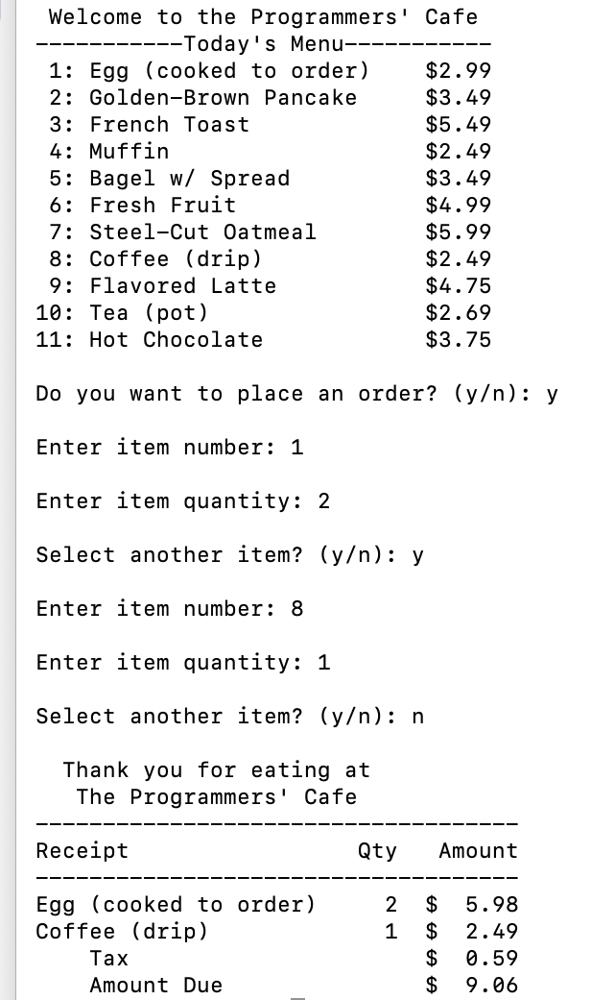
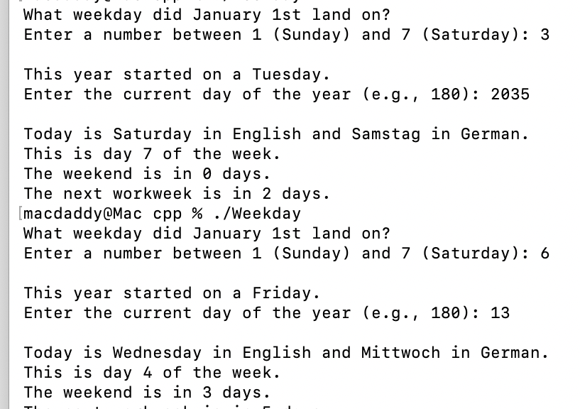
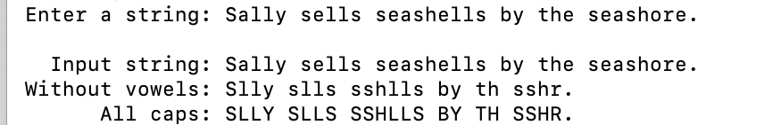
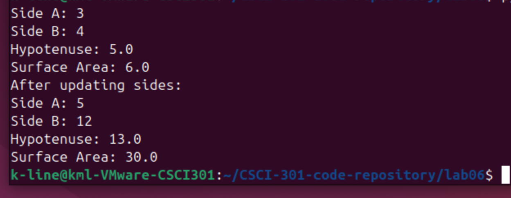

# Kimberly Line

## Computer Science Student

Kimberly Line is a Computer Science student at Charleston Southern University.

---

## About Me

I am currently pursuing a Bachelor of Technology in Computer Science at Charleston Southern University. My background includes professional experience in account management and operations, and I am now focused on strengthening my technical skills through coursework and hands-on projects. My studies have included programming, scripting languages, networking, and cybersecurity.

---

## Technical Skills

**Programming:** Python, C++, Bash  
**Systems:** Linux, Ubuntu, Virtual Machines  
**Networking:** TCP/IP, LAN/WAN fundamentals  
**Tools:** GitHub, VS Code  
**Databases:** MySQL (basic)

---

## Education

Charleston Southern University  
Bachelor of Technology in Computer Science (Expected 2026)

Trident Technical College  
Associate Degree in Network Systems Management

## Programming Projects

*For access to my private project repositories, please [email me](mailto:example@csustudent.net?subject=GitHub%20Access) with the subject line, GitHub Access.

---
### Project 1 - Restaurant Program (C++)

Developed in C++, this program loads a menu from a file that lets customers choose the items and quantities they want. Then prints a formatted receipt that includes prices, totals, and sales tax.

[View Project Repository](https://github.com/WonderLine14/restaurant-cpp)

---
### Project 2 - Weekday Program (C++)

Developed in C++, this program asks what weekday January 1 was and today's day of year, then figures out today's weekday, prints it in English and German, shows the week position, and displays how many days until Saturday and until next Monday.

[View Project Repository](https://github.com/WonderLine14/weekday-cpp)

---
### Project 3 - Vowel Remover Program (C++)

Developed in C++, this program removes all the vowels from a string and converts the remaining consonants to uppercase.

[View Project Repository](https://github.com/WonderLine14/vowelremover-cpp)

---
### Lab06 – RightTriangle (Python)

Developed in Python, this program creates a RightTriangle class that uses two sides to calculate the hypotenuse and surface area. It includes constructors, getters and setters, and test code to demonstrate functionality.

[View Project Repository](https://github.com/WonderLine14/Lab06)

-------------

# Ethics Papers

### Artificial Intelligence, Ethics, and the Future of Computer Science

This paper examines ethical concerns in artificial intelligence using the Penn State ethical decision model, along with ACM and IEEE codes, focusing on issues such as bias, privacy, and accountability.

- **Class:** CSCI 301 – Survey of Scripting Languages  
- **Grade:** 100

[View Paper](ai-ethics.pdf)

---

### Ethics and the Internet

This paper explores how the growth of the internet and artificial intelligence has impacted privacy, manipulation, and data ethics, while applying a Christian worldview and professional responsibility.

- **Class:** CSCI 235 Procedural Programming
- **Grade:** 

[View Paper](internet-ethics.pdf)

---

### Ethical Challenges in Autonomous Vehicles

This paper explores the ethical issues surrounding autonomous vehicles, including decision-making, safety, and responsibility, and how these technologies impact society.

-   **Class:** CSCI 332: APPLIED NETWORKING
-   **Grade:** 100

[View Paper](autonomous-vehicles-ethics.pdf)

-------------

### [Presentation 1 Title](/pdf/sample_presentation.pdf)

- **Class:** 
- **Grade:**

### [Presentation 2 Title](/pdf/sample_presentation.pdf)

- **Class:** 
- **Grade:**

---

Page template forked from <a href="https://github.com/csu-cs/csci-portfolio">CSU-CS</a>

<!-- Remove above link if you don't want to attributive -->
